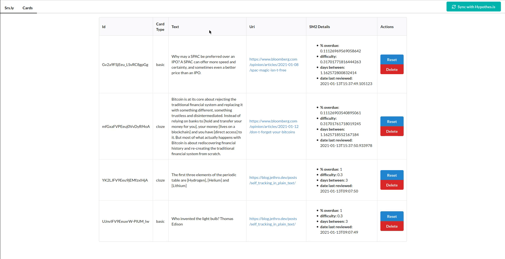

# DEPRECATED

Deprecated in favour of https://github.com/jethrokuan/srsly/

The new repo is a free, "hosted" version of the service.

# Srs.ly

A proof-of-concept spaced repetition system built on top of hypothes.is.

See [this blog post](https://blog.jethro.dev/posts/taking_srs_seriously/ "this blog post") for more details.



## Installation

You can launch an instance of this using Docker. First, retrieve your API token [here](https://hypothes.is/account/developer).

Run the instance via:

```sh
docker run -d \
  -p 8080:8080 \
  -v ~/db:/db \
  -e HYPOTHESIS_USER=username \
  -e HYPOTHESIS_TOKEN=tokenhere \
  jethrokuan/srsly
```
